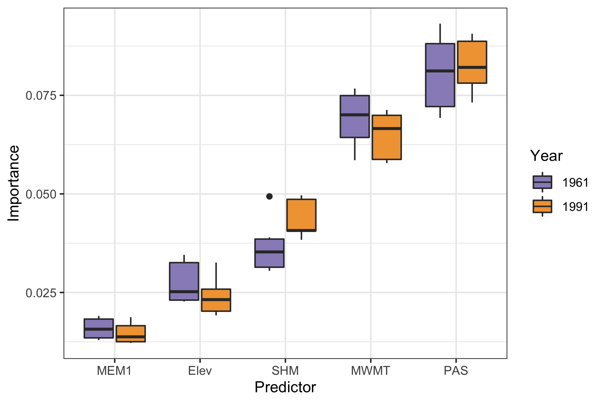
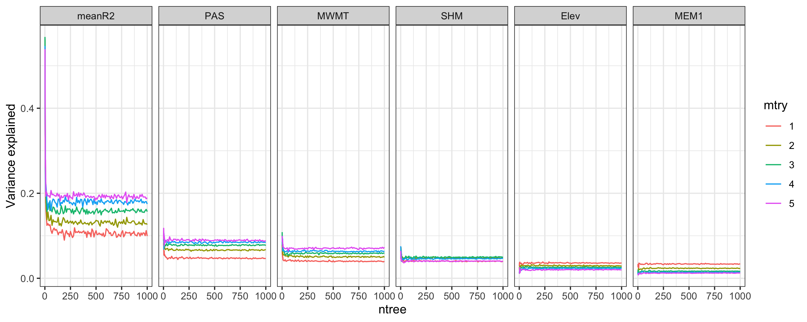

# Identifying putative adaptive variation through genetic-environment association (GEA) analyses

To identify putative adaptive variation, I identified candidate SNPs with redundancy analysis (RDA) and latent factor mixed models (LFMM). The intersection of these candidate SNP sets were used for subsequent analysis with gradient forest.

## Environmental variable selection

Current and projected climate data for North America were obtained from the [AdaptWest Project](https://adaptwest.databasin.org/pages/adaptwest-climatena/)(AdaptWest Project 2021). The data set included 33 bioclimate variables (described [here](http://s3-us-west-2.amazonaws.com/www.cacpd.org/CMIP6/ReadMe_ClimateNA_CMIP6.txt)) and elevation.

Correlated environmental variables were identified by $\vert r \vert < 0.75$ based on the environment values extracted for an individual's sampling location. Correlated variables were reduced by selecting environmental variables based on the biological relevance to the Rosy-Finch (see [environmental variable script](./r-scripts/environmental_variable_selection.R)). This resulted in a final data set of 4 variables:

- Mean temperature of the warmest month (MWMT)
- Precipitation as snow (PAS)
- Elevation (Elev)
- Summer heat moisture index (SHM)

The filtered genotypes of the 104 unrelated BCRF individuals were used as the genetic data for these analyses. This data set had 429,442 SNPs.

Since GEA analyses assume that populations are in equilibrium with their environment (i.e. optimally adapted to current conditions without a lag from previous conditions), I tested both 1961-1990 and 1991-2020 as two *baseline* environmental data sets. Candidate SNPs associated with environment for both of these time periods were identified from RDA and LFMM, and the importance of the environmental predictors were then compared. tldr; there was minimal difference, scroll for details.

## Redundancy analysis (RDA)

First, I created spatial variables to use to condition the RDA model on, as a method to account for population structure. Then, I performed RDA using individual genotypes as the response variable and the environmental variables identified above as the predictor variables.

### Moran Eigenvector Maps (MEMs)
To account for population structure (via association with geography) in the RDA, I created Moran Eigenvector Maps (MEMs) as spatial variables in the R package `adespatial`. In short, I used the lat/lon coordinates of the BCRF sampling locations to create spatial distances, which, in turn, were used to create the MEMs. Additional explanation of MEMs can be found [here by Stéphane Dray](https://cran.r-project.org/web/packages/adespatial/vignettes/tutorial.html). My code for creating MEMs for Brown-capped Rosy-Finch is [here (MEMs script)](./r-scripts/mems.R).

### Running RDA

RDA was performed R (see [RDA script](./r-scripts/run_rda.1961_1990.R)) using the [`vegan` package](https://cran.r-project.org/web/packages/vegan/index.html): . The general model used was:

```
Genotypes ~ Condition(MEM1) + Elev + MWMT + PAS + SHM
```

## Latent factor mixed models (LFMM)

To correct for population structure in LFMM, I calculated ancestry values with the `snmf` function from the `LEA` R package ([see `snmf` script](./r-scripts/run_snmf.R)). The results of this showed that K=1 was the best option based on cross-validation error. However, errors were also close with K=2, which I had previously determined might indicate population structure between Pike's Peak and other sampling sites (see [Population genetics section](https://github.com/mgdesaix/bcrf-climate/blob/main/03_PopulationGenetics/Popgen.md)). So, to account for potential weak structure, I set K=2.

I used LFMMs for each of the four environmental variables and combined all SNPs from each of the univariate tests in a set of the LFMM candidate SNPs (see [example LFMM script](./r-scripts/run_lfmm_array_1991_K2.r))

## Candidate SNPs

The intersection of SNPs identified in both RDA and LFMM provided the candidate SNP set for looking at putatively adaptive variant turnover with gradient forest. The 1961-1990 environmental data set had 501 SNPs and the 1991-2020 environmental data set had 436 SNPs. 128 SNPs were unique to either data set.

## Gradient forest analysis.

### Comparing baseline environmental data sets

Genetic-environment association analyses assume that populations are at an adaptive equilibrium with the environment being tested. However there may be adaptational lag, especially in long-lived species, which means adaptive genetic variation reflects past selective pressures. We compared both environmental data sets in order to see if there was different inference from the environmental predictors if adaptational lag was occurring (using the 1961-1990 baseline) or wasn't occurring (1991-2020). Specifically, we created gradient forest models (see below for running) for both time periods and compared environmental predictor importance. Our results showed similar patterns of the relative importance of environmental predictors, thus suggesting, a minimal influence of considering adaptational lag. Therefore, we included subsequent analyses with the 1991-2020 data set, which included the time period for which our samples were collected.



### Gradient forest tuning parameters

Gradient forest is an algorithm that builds on random forests. In its use for landscape genetics, genetic data are the response, while environmental and spatial data are the predictors. Two of the main parameters are 1) the number of trees grown in the model (*ntree*) and 2) the subset of predictors randomly selected for a tree (*mtry*; **side note: In case you were wondering, using all predictors is basically the machine learning method of bagging**). 

As in all machine learning applications, a variety of parameters should be tested to see what is most appropriate for the data (though, admittedly, in ecological applications this is commonly not done). To evaluate, we tested *ntree* from 10 to 1000 by 10s, and *mtry* from 1 to 5 (all predictors). This was done on the cluster running our [tuning parameter job array script](./slurm-scripts/get-gradient-forest-tuning.sh) which reads in the parameter combination of a single run to an [R script for gradient forest](./r-scripts/run-gradient-forest-tuning.r). The R script basically runs gradient forest as recommended by the developers (Ellis et al. 2012), with varying the parameters. Simplified it looks like this:

```r
bcrfForest <- gradientForest(cbind(Env.pred, Gen.resp),
                                 predictor.vars = colnames(Env.pred[,-1]),
                                 response.vars = colnames(Gen.resp),
                                 ntree = ntree,
                                 mtry = mtry,
                                 transform = NULL,
                                 compact = T,
                                 maxLevel = lev,
                                 corr.threshold = 0.5,
                                 trace = F)
```

where *ntree* and *mtry* are being specified by input variables. 

We identified convergence at 100 trees (*ntree* = 100) and maximum accuracy occurring with all 5 predictors used (*mtry* = 5)




### Gradient forest biplot and variable importance

Above, the `gradientForest` function creates an object, which you can find extensive detail about from the developers (https://rdrr.io/rforge/gradientForest/man/gradientForest.html). We then used this to predict genetic composition from unsampled locations, using the identified turnover functions. Evaluating the turnover functions in gradient forest is **essential** to understanding what is going on in the model. For example, are the patterns step-wise or is there sharp turnover at a specific environmental gradient?? 

Using the turnover functions, we then predicted genetic composition to the remaining portions of the unsampled breeding range. We created biplots that show the influence of environmental predictors on genetic variation turnover and plotted the predicted genetic composition across the landscape. The details of those analyses can be found here: [Gradient forest markdown](./r-scripts/gradient-forest-general.Rmd)


## References

AdaptWest Project. 2021. Gridded current and projected climate data for North America at 1km resolution, generated using the ClimateNA v7.01 software (T. Wang et al., 2021). Available at adaptwest.databasin.org.
