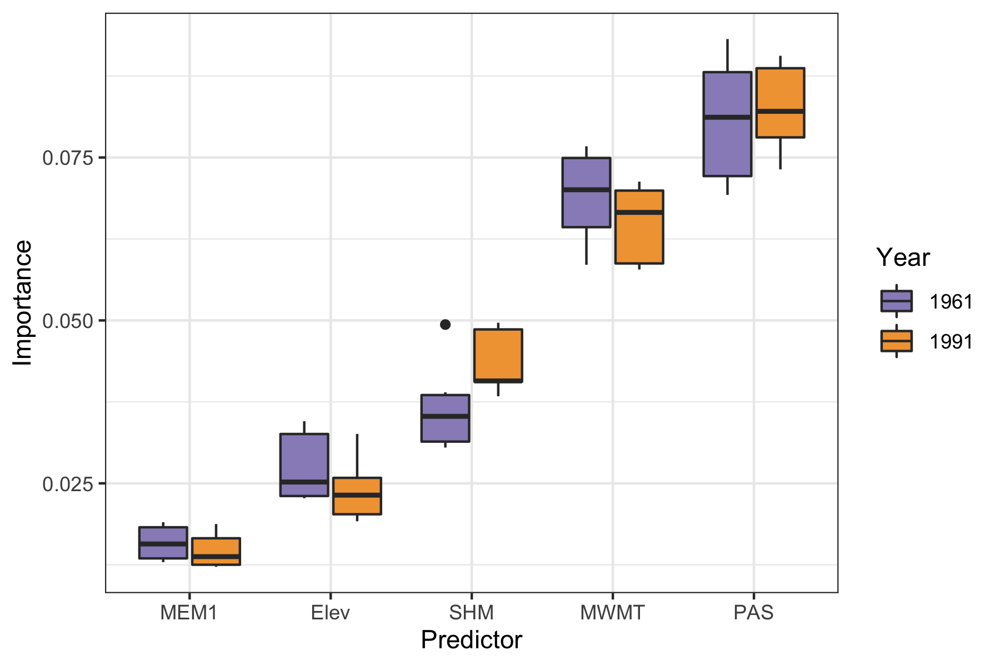
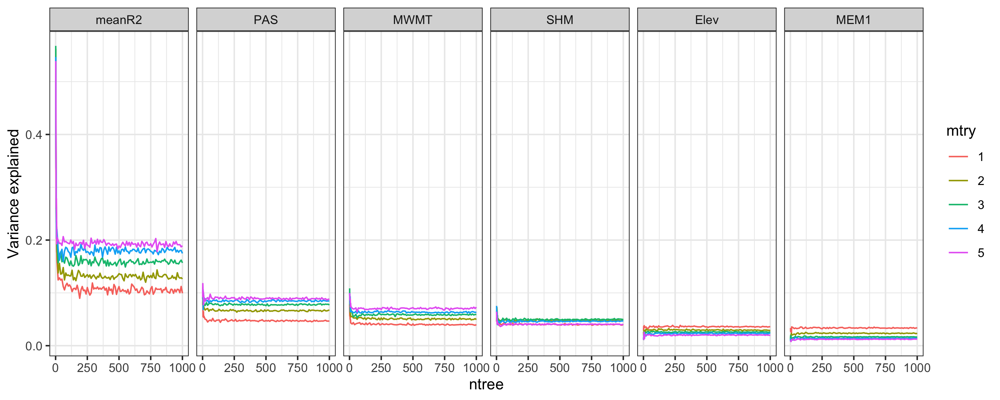

# Identifying putative adaptive variation turnover across the landscape

## Gradient forest analysis.

### Comparing baseline environmental data sets

Genetic-environment association analyses assume that populations are at an adaptive equilibrium with the environment being tested. However there may be adaptational lag, especially in long-lived species, which means adaptive genetic variation reflects past selective pressures. We compared both environmental data sets in order to see if there was different inference from the environmental predictors if adaptational lag was occurring (using the 1961-1990 baseline) or wasn't occurring (1991-2020). Specifically, we created gradient forest models (see below for running) for both time periods and compared environmental predictor importance. Our results showed similar patterns of the relative importance of environmental predictors, thus suggesting, a minimal influence of considering adaptational lag. Therefore, we included subsequent analyses with the 1991-2020 data set, which included the time period for which our samples were collected.



### Gradient forest tuning parameters

Gradient forest is an algorithm that builds on random forests. In its use for landscape genetics, genetic data are the response, while environmental and spatial data are the predictors. Two of the main parameters are 1) the number of trees grown in the model (*ntree*) and 2) the subset of predictors randomly selected for a tree (*mtry*; **side note: In case you were wondering, using all predictors is basically the machine learning method of bagging**). 

As in all machine learning applications, a variety of parameters should be tested to see what is most appropriate for the data (though, admittedly, in ecological applications this is commonly not done). To evaluate, we tested *ntree* from 10 to 1000 by 10s, and *mtry* from 1 to 5 (all predictors). This was done on the cluster running our [tuning parameter job array script](./slurm-scripts/get-gradient-forest-tuning.sh) which reads in the parameter combination of a single run to an [R script for gradient forest](./r-scripts/run-gradient-forest-tuning.r). The R script basically runs gradient forest as recommended by the developers (Ellis et al. 2012), with varying the parameters. Simplified it looks like this:

```r
bcrfForest <- gradientForest(cbind(Env.pred, Gen.resp),
                                 predictor.vars = colnames(Env.pred[,-1]),
                                 response.vars = colnames(Gen.resp),
                                 ntree = ntree,
                                 mtry = mtry,
                                 transform = NULL,
                                 compact = T,
                                 maxLevel = lev,
                                 corr.threshold = 0.5,
                                 trace = F)
```

where *ntree* and *mtry* are being specified by input variables. 

We identified convergence at 100 trees (*ntree* = 100) and maximum accuracy occurring with all 5 predictors used (*mtry* = 5)




### Gradient forest biplot and variable importance

Above, the `gradientForest` function creates an object, which you can find extensive detail about from the developers (https://rdrr.io/rforge/gradientForest/man/gradientForest.html). We then used this to predict genetic composition from unsampled locations, using the identified turnover functions. Evaluating the turnover functions in gradient forest is **essential** to understanding what is going on in the model. For example, are the patterns step-wise or is there sharp turnover at a specific environmental gradient?? 

Using the turnover functions, we then predicted genetic composition to the remaining portions of the unsampled breeding range. We created biplots that show the influence of environmental predictors on genetic variation turnover and plotted the predicted genetic composition across the landscape. The details of our code for those analyses can be found here: [Gradient forest markdown](./r-scripts/gradient-forest-general.Rmd)


## References

AdaptWest Project. 2021. Gridded current and projected climate data for North America at 1km resolution, generated using the ClimateNA v7.01 software (T. Wang et al., 2021). Available at adaptwest.databasin.org.
